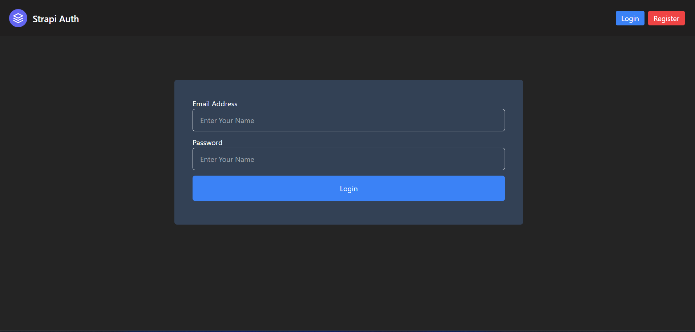
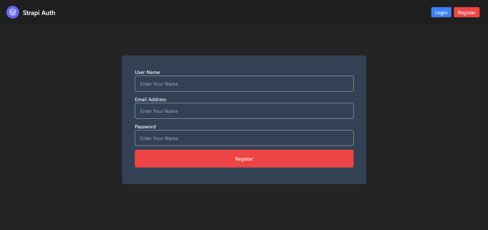

# Strapi Auth
## React + TypeScript + Vite + Strapi 


### for setup frontend

```bash
      npm i // to install dep.
      npm run dev // to start server 
```


### for setup backend

1. open mysql and create database name `strapi-auth`

```bash

      npm i // to install dep.
      npm run develop // to start server 
```





